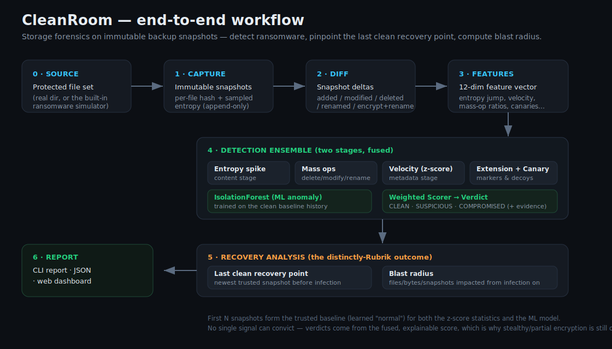
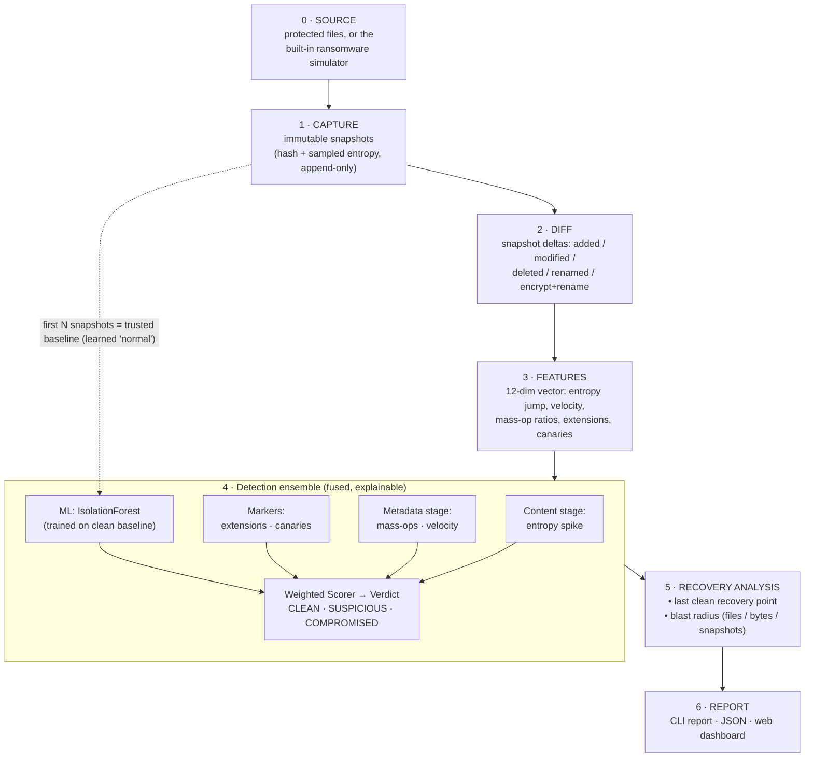

# About CleanRoom — in plain English

This document explains, in simple terms, what CleanRoom is, how it works from
start to finish, who would use it, and why it's built the way it is. A workflow
diagram is at the end.

---

## 1. What this project does

Ransomware's whole business model is this: it sneaks in, quietly encrypts or
deletes your files, and then demands money to give them back. Modern companies
defend against this with **immutable backups** — copies of their data taken at
regular intervals that, once written, can never be changed. Even if attackers
encrypt everything on your live systems, you can restore from a backup.

But that raises two hard questions during an actual attack:

1. **Which backup is still safe?** If the ransomware was quietly encrypting files
   for two weeks before anyone noticed, your most recent backups are *also*
   infected. Restore from the wrong one and you re-infect yourself.
2. **How bad is it?** Which files, how much data, and how many backups did the
   attack touch?

**CleanRoom answers both.** It looks at a series of backup snapshots, figures out
which ones show signs of ransomware, then tells you:

- **the last clean snapshot** you can safely recover from, and
- **the blast radius** — everything the attack affected from the moment it started.

Crucially, it does this by examining the **backups themselves** (storage
forensics), not by installing software on every laptop and server (an "agent").
It never touches your production systems, so it can't slow them down or become a
new thing for attackers to disable.

Think of it as a detective that studies photographs of a room taken every day. By
comparing yesterday's photo to today's, it spots the moment the burglar showed
up — and points to the last photo where everything was still in place.

---

## 2. How it works (end to end)

CleanRoom runs as a pipeline of six stages. Here is the whole journey, including
the tricky cases it handles.

### Stage 0 — Something to protect
The input is a set of files. In the real world that's a protected folder or
volume. Because there's no live backup system to plug into for a demo, CleanRoom
ships a **ransomware simulator** that builds a realistic file collection
(invoices, HR policies, source code, images, archives) and can then "attack" it
like real ransomware would.

### Stage 1 — Capture immutable snapshots
CleanRoom walks the files and records, for each one: its size, a **content hash**
(a fingerprint that changes if even one byte changes), and its **entropy** (more
on that below). It never stores the file's actual contents — only these
fingerprints. Each snapshot is written once to an **append-only store** that
refuses to be overwritten, mirroring how a real immutable backup works.

> **Entropy** is a measure of randomness. Normal files — text, spreadsheets,
> code — have patterns and structure, so their entropy is low-to-medium.
> Encrypted files look like pure random noise, which has the *highest possible*
> entropy. So a file whose entropy suddenly jumps toward the maximum is almost
> certainly being encrypted. This is "the encryption signature."

### Stage 2 — Compare snapshots (the delta)
For every pair of consecutive snapshots, CleanRoom computes what changed: files
**added**, **modified**, **deleted**, or **renamed**. This is where the important
edge cases live:

- **Normal edits** (a few files changed, entropy stays low) — expected, ignored.
- **Encrypt-in-place** (a file's content is scrambled but keeps its name) — caught
  as a *modification* with a big entropy jump.
- **Encrypt-and-rename** (e.g. `report.txt` becomes `report.txt.lockbit`) — the
  naïve view would see this as one file deleted and a totally different one added,
  which would *hide* the entropy jump. CleanRoom recognizes that the new name is
  the old name plus a suffix and correctly treats it as an encryption of the same
  file, preserving the signal.
- **Pure rename** (name changes, content identical) — detected by matching
  fingerprints, so it isn't mistaken for an attack.
- **Mass deletion** (a wiper destroying data) — caught as an unusually large
  number of deletes.

### Stage 3 — Turn changes into numbers (features)
Each snapshot's changes are summarized into a small, fixed set of numbers: how
big the entropy jump was and how widespread, how fast files changed compared to
normal, what fraction of files were deleted/modified/renamed, whether any files
have known ransomware extensions, and whether any **canary files** were touched.

> **Canary files** are harmless decoy files planted in the data that nothing
> should ever legitimately change. If one gets encrypted or deleted, that's a
> near-certain sign something is walking through the data encrypting everything.

### Stage 4 — Detect (two stages, then fused)
This mirrors how Rubrik's Anomaly Detection works: a **behavioral stage** (based
on file-system metadata — how much changed, how fast, mass operations) and a
**content stage** (based on entropy — the encryption signature). CleanRoom runs
several transparent rule-based detectors plus one machine-learning model:

- **Entropy detector** — how broadly and sharply entropy jumped.
- **Mass-ops detector** — mass delete / modify / rename.
- **Velocity detector** — change speed vs. this system's own normal rhythm.
- **Extension detector** — known ransomware file extensions (`.locked`, `.crypt`…).
- **Canary detector** — were any decoy files touched.
- **ML anomaly model** — an *IsolationForest* trained only on the earliest,
  trusted snapshots, so it learns what "normal" looks like for *this* data and
  flags snapshots that don't fit.

The key idea: **no single signal is allowed to convict on its own.** All the
signals are combined into one score between 0 and 1 by a weighted **scorer**,
which maps the score to a verdict: `CLEAN`, `SUSPICIOUS`, or `COMPROMISED`. This
is why CleanRoom catches the **stealthy "slow-burn" strain** that only encrypts
part of each file to dodge simple entropy thresholds — the modest entropy rise,
plus the suspicious extension, plus the elevated velocity, *together* add up to a
conviction even though no single clue is decisive.

Every verdict carries its evidence ("64% of changed files are now high-entropy,
mean +3.54 bits/byte"), so a human can see exactly why — and reproduce the math
by hand if they want.

### Stage 5 — Recovery analysis (the part that matters most)
Detecting the attack is only half the job. CleanRoom then:

- finds the **last clean recovery point** — the newest snapshot *before* the
  attack that is still trusted, and
- computes the **blast radius** — how many files were encrypted, deleted, renamed
  or added (ransom notes), how much data, and how many snapshots were impacted
  from the infection onward.

It turns that into a concrete recommendation: *"Restore from snapshot 0004. Do
not restore from 0005 or later."*

**The all-clear case:** if no snapshot crosses the compromised threshold,
CleanRoom reports the timeline is clean and the latest snapshot is safe to use —
with a confidence figure.

### Stage 6 — Report
The results are available three ways: a rich **command-line report**, a
**JSON** output for automation, and an interactive **web dashboard** with a
timeline chart, KPI cards, and a forensic table.

### How well does it work?
The built-in benchmark generates many fresh, labeled attack timelines and
measures detection quality. On the shipped simulator it currently scores **100%
precision and recall** across all three families. The **95%** figure in the
tagline is deliberately kept as a *conservative real-world target*: real estates
are noisier than a simulator, so we quote a number we're confident is achievable
in the wild rather than the perfect score the synthetic benchmark produces. You
can reproduce the benchmark yourself with `cleanroom benchmark`.

---

## 3. Use cases and target users

**Who would use CleanRoom (or a production system built on these ideas):**

- **Backup & storage administrators** who need to know, the instant an attack is
  suspected, which restore point is safe — without manually diffing terabytes.
- **Security operations (SOC) / incident responders** who need the blast radius
  and a defensible recovery recommendation fast, during a live incident.
- **IT teams at regulated organizations** — healthcare, finance, government —
  where recovery-time and data-integrity guarantees are contractual or legal.
- **Platform / SRE engineers** integrating an automated "is this backup clean?"
  gate into their backup pipeline (via the JSON output).

**Concrete situations it's built for:**

- *"We think we were hit last night — which backup do we restore?"*
- *"Prove that last Tuesday's backup was clean before we recover from it."*
- *"Alert me automatically if any nightly backup shows encryption behavior."*
- *"After the incident, exactly what did the attacker touch, and how much?"*

**Where it deliberately does *not* play:** it is not an endpoint/EDR agent, not a
live network monitor, and not an LLM copilot. It is a focused, explainable
**storage-forensics detection engine** for backup data.

---

## 4. Tech stack — what was used and why

CleanRoom is written in **Python 3.10+**. The guiding principle was: keep the
core dependency-light and explainable, and only reach for a heavier tool where it
genuinely earns its place.

| Area | Chosen | Why | Alternatives considered & why not |
|---|---|---|---|
| **Language** | Python | Fast to build; superb data/ML ecosystem; trivially runnable on any machine, which was a hard requirement. | **Go / Rust / C++** are closer to Rubrik's real backend and faster on huge scans, but far slower to build and harder for a reviewer to run locally. The entropy/diff hot-path is isolated, so it could be dropped into Go later without redesign. |
| **Core math** | NumPy | Vectorized entropy and feature math; already the ecosystem standard. | Hand-rolled pure-Python loops — simpler but slower and more code to maintain. |
| **Machine learning** | scikit-learn (**IsolationForest**) | The right tool for *unsupervised* anomaly detection: real deployments have lots of clean history but no labeled attacks to train on. Lightweight, deterministic, no GPU. | **TensorFlow / PyTorch** — massive dependencies and overkill; deep learning needs large labeled datasets we won't have. **A supervised classifier** — needs labeled attacks and generalizes poorly to novel strains. |
| **API** | FastAPI + Uvicorn | Tiny, modern, async, self-documenting; serves both the JSON API and the dashboard from a few lines. | **Flask** — fine but less modern; **Django** — far too heavy for two endpoints. |
| **Dashboard** | Plain HTML + vanilla JS + Chart.js (via CDN) | Zero build step — no `npm install`, no bundler — so "run it locally" stays a single command. Chart.js gives a clean timeline chart for free. | **React / Vue** — a better fit for a large app, but they'd add a Node toolchain and a build step, working against the instant-setup goal. |
| **CLI output** | Rich | Turns the report into a readable, colored terminal timeline and panels with almost no code. | **Plain `print`** — works but ugly; **Textual** — a full TUI framework, more than needed. |
| **Storage** | Append-only JSON manifests on disk | Human-readable, dependency-free, and the append-only rule mirrors real immutable/WORM backups. | **SQLite / a database** — better at scale, but adds setup and hides the immutability guarantee behind SQL; the storage layer sits behind an interface, so swapping it in later is a drop-in change. |
| **Tests** | pytest | The de-facto standard; concise, powerful fixtures. | `unittest` — more boilerplate for no benefit. |

### Why the architecture looks the way it does
The code is organized into clean layers — **domain** (pure data), **services**
(capture/diff/features), **detection** and **recovery**, an **application facade**,
and **interfaces** (CLI/API/dashboard) — and follows standard OOP/SOLID
principles:

- **Single Responsibility** — each class does one thing (an entropy calculator, a
  differ, one detector per signal).
- **Open/Closed + Strategy pattern** — every detector and every ransomware family
  is an interchangeable strategy; adding a new one is a new small class, with no
  edits to the engine.
- **Dependency Inversion** — the core depends on abstract *ports* (e.g. a snapshot
  repository interface), never on concrete storage, so the disk layer can be
  swapped for a database without touching the logic.
- **Facade** — the CLI, API, and tests all go through one `CleanRoomApp` object, so
  there's never a second, subtly-different code path.
- **Value objects** — snapshots, deltas and verdicts are immutable, matching the
  immutability of the backups themselves and making analysis reproducible.

This mirrors **Rubrik's RIVET values** in a small way: **Integrity** and
**Transparency** show up as fully explainable verdicts (every score shows its
evidence and can be recomputed by hand); **Excellence** as the layered,
test-covered architecture; **Velocity** as the "recover in minutes, not days"
outcome and one-command setup; **Relentless** as an ensemble that keeps catching
attacks even when a single clue is too weak to convict.

---

## 5. Workflow diagram



If the image above doesn't render in your viewer, open
[`docs/workflow.svg`](docs/workflow.svg) directly. The same flow, as text:


```
   SOURCE ─▶ CAPTURE ─▶ DIFF ─▶ FEATURES ─▶ DETECTION ENSEMBLE ─▶ RECOVERY ─▶ REPORT
   (files/                         (entropy,   (5 heuristics +        (last clean   (CLI /
    simulator)  (immutable  (deltas) velocity,  IsolationForest        point +      JSON /
                 snapshots)          mass-ops,   → weighted verdict)    blast        dashboard)
                                     canaries)                          radius)
```
